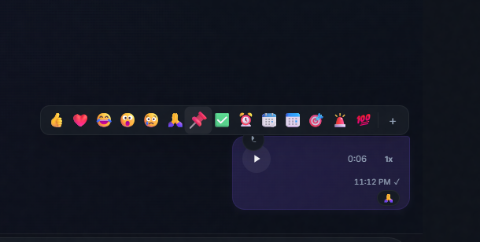

<p align="center">
  
</p>

<h1 align="center">Mentora — Company Platform</h1>

<p align="center">
  A real-time <strong>company collaboration platform</strong> — group chat, service orders, portfolio & team management.
  <br />
  Web (Next.js) + Android (Capacitor) · Socket.IO + Pusher realtime · PostgreSQL · Push notifications.
</p>

<p align="center">
  
  
  
  
  
  
  
  
  
</p>

---

## Table of Contents

- [Overview](#overview)
- [Features](#features)
- [Architecture](#architecture)
- [Tech Stack](#tech-stack)
- [Project Structure](#project-structure)
- [Data Model](#data-model)
- [Real-time Events](#real-time-events)
- [Getting Started](#getting-started)
- [Environment Variables](#environment-variables)
- [Running the App](#running-the-app)
- [Mobile App (Capacitor / Android)](#mobile-app-capacitor--android)
- [CI/CD — Android Builds](#cicd--android-builds)
- [Deployment](#deployment)
- [License](#license)

---

## Overview

**Mentora** is a full-stack corporate platform where teams communicate, track work orders and showcase a portfolio. It ships as **two clients**:

1. **Web app** — Next.js (App Router) with a polished, animated chat UI and a full REST API.
2. **Android app** — a native Capacitor wrapper around a lightweight Bootstrap frontend (`mentora_app/`), with **FCM push notifications**.

The backend runs on a **custom Node.js server** (`server.js`) that hosts both the Next.js request handler and a **Socket.IO** realtime engine, while the browser client also receives realtime updates through **Pusher Channels**.

---

## Features

### Real-time Chat 💬
- **Group conversations** with participants, group title & image
- **Live messaging** — send / edit / delete (for everyone or for me) / pin messages
- **Read receipts** (`SENT / DELIVERED / READ`) with per-user `MessageRead` tracking
- **Typing & recording indicators** broadcast to the conversation
- **Reactions** (one per user per message, upserted), **replies/threads**, **@mentions**
- **Message attachments** (images, files) uploaded to **Cloudinary**
- **Invite codes** to join groups (expiry, max uses, active toggle) — join via REST or Socket.IO (`join-via-invite`)
- **Online presence** — `user-online` / `user-offline` broadcasts, auto-join of all your conversations
- **Default group** auto-created & auto-join ("عام") so every user lands in a conversation
- **Search & deep links** — `/chat?active=<conversationId>`

### Work Orders 🧾
- Order intake with title, client, **category**, **service**, **urgency**, date & description
- Status workflow (`متاح` … ) and **assigned employee**
- Optional uploaded file per order

### Portfolio 📁
- **Categories** with portfolio items (cover image + optional **sample PDF**)
- Per-item visibility control (`isVisible`) — show/hide work to clients

### Users & Roles 👥
- Roles: **admin · hr · employee · user** (RBAC enforced on routes & Socket.IO, managers = admin/hr)
- JWT authentication (bcrypt hashed passwords), profile & avatar (Cloudinary)
- Password-strength meter + caps-lock hint on the login page

### Mobile & Push 📱
- **Capacitor 8** Android app (`com.company.platform`)
- **FCM push notifications** via `firebase-admin` + `@capacitor/push-notifications`; device tokens registered server-side
- Splash screen, status bar theming, voice input, bottom tab bar (mobile-first chat layout)

### UX & Polish ✨
- Bilingual-friendly (RTL Arabic UI + English labels), dark/light theme
- Animated components (AuroraBackground, SpotlightCard, MagneticButton, ShinyText)
- Emoji picker, image lightbox, context menus, splash screen, toasts

---

## Architecture

```
                            ┌────────────────────────────────────────────┐
 Browser (Next.js UI) ─────►│  server.js (custom Node server)            │
                            │  ├── Next.js request handler (pages + API) │
 Android (Capacitor) ──────►│  └── Socket.IO engine (JWT auth)          │
 mentora_app (Bootstrap) ──►│        ├── online presence / rooms         │
                            │        ├── messages · reactions · reads    │
                            │        └── invites · typing · recording    │
                            └──────────────┬─────────────────────────────┘
                                           │ Prisma (adapter-pg)
                                           ▼
                                     PostgreSQL
                                           │
                              ┌────────────┴─────────────┐
                              ▼                          ▼
                          Cloudinary               Pusher Channels
                     (files, avatars, PDFs)        (browser realtime)
                              ▼
                          Firebase Admin
                     (FCM push notifications)
```

### Two realtime layers
- **Socket.IO** (server.js) — the source of truth for chat events; authenticated per-connection with a JWT, rooms are conversation-scoped.
- **Pusher Channels** — browser client subscribes to private channels (`/api/pusher/auth` issues auth), complementing Socket.IO for resilient delivery.

---

## Tech Stack

| Layer        | Technology                                              |
|--------------|---------------------------------------------------------|
| Framework    | Next.js 16 (App Router), React 19, TypeScript           |
| Server       | Custom Node.js (`server.js`) — Next handler + Socket.IO |
| Realtime     | Socket.IO (server) + Pusher Channels (client)           |
| Database     | PostgreSQL + Prisma ORM 7 (`@prisma/adapter-pg`)        |
| Auth         | JWT (`jsonwebtoken`), bcryptjs, AuthContext / RBAC      |
| Mobile       | Capacitor 8 (Android), SplashScreen, StatusBar, PushNotifications |
| Push         | Firebase Admin SDK (FCM) + `@capacitor/push-notifications` |
| Media        | Cloudinary (attachments, avatars, portfolio, PDFs)      |
| Frontend     | Tailwind CSS v4, Bootstrap 5 (mentora_app), Framer Motion, lucide-react |
| Tooling      | ESLint, TypeScript, tsx (seeds), GitHub Actions         |

---

## Project Structure

```text
server.js                    # Custom server: Next.js handler + Socket.IO engine
schema.prisma                # Prisma schema (data model)
seed.ts                      # DB seed (admin user)
capacitor.config.ts          # Capacitor Android configuration (webDir: mentora_app)
next.config.js / tsconfig.json / postcss.config.mjs

src/
├── app/
│   ├── page.tsx             # Login / Register (password strength, RTL)
│   ├── chat/page.tsx        # Chat UI (sidebar + window + mobile tab bar)
│   ├── profile/page.tsx     # User profile & avatar
│   ├── join/page.tsx        # Join conversation via invite code
│   ├── access-denied/page.tsx
│   ├── layout.tsx / template.tsx / globals.css
│   └── api/
│       ├── auth/            # login, register
│       ├── users/           # users list, /me, /me/avatar
│       ├── chat/            # conversations (+members, +image), invite (+join),
│       │                    # messages (delete, edit, pin, reaction, read),
│       │                    # typing, upload, download
│       ├── pusher/auth      # Pusher channel auth
│       └── push/            # register, unregister (FCM device tokens)
├── components/              # ChatSidebar, ChatWindow, ChatInput, MessageBubble,
│   │                        # GroupInfo, EmojiPicker, ImageLightbox, ContextMenu,
│   │                        # InviteCodeModal, JoinChatModal, ReactionViewer,
│   │                        # BottomTabBar, SplashScreen, reactbits/*, ui/*
├── context/                 # AuthContext, SocketContext, ThemeContext
├── lib/                     # prisma, auth, socket(Pusher), pusher-server,
│                            # cloudinary, firebase-admin, defaultGroup, utils
mentora_app/                 # Standalone Bootstrap frontend (Capacitor web build)
├── index.html, css/, js/    # auth + chat modules (state, messages, conversations,
│                            # events, mentions, ui, chat, pusher client)
└── proxy.mjs                # Local dev proxy → Vercel deployment
android/                     # Capacitor Android platform project (tracked for CI)
.github/workflows/HtmlMobile.yml  # Build debug APK / release AAB
```

---

## Data Model

> Full definition in `schema.prisma` (PostgreSQL).

| Model                  | Purpose                                        |
|------------------------|------------------------------------------------|
| `User`                 | Auth account; `role` enum `admin · hr · employee · user` |
| `Conversation`         | Group chat container (`isGroup`, title, image, creator) |
| `ConversationParticipant` | Many-to-many users ↔ conversations (unique pair) |
| `Message`              | Content, status (`SENT/DELIVERED/READ`), replies, reactions, `pinned`, `isEdited`, mentions |
| `MessageRead`          | Per-user read receipt (unique message+user)   |
| `MessageReaction`      | Per-user emoji reaction (unique message+user) |
| `Attachment`           | Uploaded file metadata (fileName, size, mime, url, Cloudinary `publicId`) |
| `InviteCode`           | Join code (unique), `expiresAt`, `maxUses`, `usedCount`, `isActive` |
| `DeviceToken`          | FCM device tokens per user (unique)            |
| `Order`                | Service request (category, service, urgency, date, status, assigned employee, file) |
| `Category`             | Portfolio categories (unique name)            |
| `PortfolioItem`        | Portfolio piece (cover image, sample PDF, `isVisible`) |

---

## Real-time Events

### Socket.IO — server (`server.js`)

| Event (in)                  | Event (out)                  | Description                        |
|-----------------------------|------------------------------|------------------------------------|
| `join-conversation`         | —                            | Join a conversation room           |
| `leave-conversation`        | —                            | Leave a conversation room          |
| `join-via-invite`           | —                            | Join a group with an invite code   |
| `send-message`              | `new-message`                | Persist & broadcast a message      |
| `typing` / `stop-typing`    | `user-typing` / `user-stop-typing` | Typing indicator            |
| `recording` / `stop-recording` | `user-recording` / `user-stop-recording` | Voice-note indicator |
| `edit-message`              | `message-edited`             | Edit a message (own only)          |
| `delete-message`            | `message-deleted` / `message-edited` | Delete for all / placeholder |
| `pin-message`               | `message-pinned`             | Toggle message pin                 |
| `add-reaction` / `remove-reaction` | `message-reaction-added` / `message-reaction-removed` | Reactions |
| `mark-read`                 | `messages-read`              | Bulk read receipts per conversation |
| `member-added`              | `member-added`               | Notify added members               |
| `conversation-updated`      | `conversation-updated`       | Group metadata updates             |
| `connection` / `disconnect` | `user-online` / `user-offline` | Presence                       |

### Pusher Channels — browser client (`src/lib/socket.ts`)

Subscribe per conversation via `subscribeToChannel(...)`; channels are private and authenticated at `/api/pusher/auth`.

---

## Getting Started

### Prerequisites

- **Node.js** >= 20
- **PostgreSQL** (local or hosted — e.g. Neon, Supabase, RDS)
- Accounts for: **Cloudinary**, **Pusher**, **Firebase** (FCM), and optionally **Vercel**

### Installation

```bash
# 1. Clone & install
git clone https://github.com/ahmed404mo/chat.git
cd chat
npm install

# 2. Configure environment (see below) — cp .env.example .env

# 3. Generate Prisma client & create schema
npx prisma generate
npx prisma db push          # or `npx prisma migrate dev`

# 4. Seed an admin user
npx prisma db seed
```

### Run

```bash
# Development (custom server + Socket.IO)
npm run dev

# Production
npm run build
npm start
```

Open [http://localhost:3000](http://localhost:3000).

> The custom `server.js` (not `next start`) is required for Socket.IO. `next start` serves the API but without the realtime engine.

---

## Environment Variables

| Variable                      | Description                                     |
|-------------------------------|-------------------------------------------------|
| `DATABASE_URL`                | PostgreSQL connection string (Prisma)           |
| `USER_TOKEN_SECRET_KEY`       | JWT signing secret (Socket.IO + API auth)       |
| `ORIGINS`                     | Comma-separated CORS origins for Socket.IO      |
| `PORT`                        | Server port (default `3000`)                    |
| `PUSHER_APP_ID`               | Pusher app id                                   |
| `PUSHER_KEY` / `PUSHER_SECRET`| Pusher keys (server side)                       |
| `NEXT_PUBLIC_PUSHER_KEY`      | Pusher key exposed to the browser               |
| `PUSHER_CLUSTER` / `NEXT_PUBLIC_PUSHER_CLUSTER` | Pusher cluster (e.g. `mt1`)      |
| `CLOUD_NAME` / `API_KEY` / `API_SECRET` | Cloudinary credentials                  |
| `FIREBASE_SERVICE_ACCOUNT` (or `firebase-adminsdk-*.json`) | Firebase Admin credentials (FCM) |
| `NEXT_PUBLIC_APP_URL`         | Public app base URL (deep links)                |

> ⚠️ Never commit real secrets. `.gitignore` already excludes `.env*`, Firebase admin keys, APK/AAB and keystores — for CI, pass them as **GitHub secrets**.

---

## Mobile App (Capacitor / Android)

The Android app wraps the `mentora_app/` static frontend (Bootstrap + vanilla JS modules) with Capacitor:

```bash
# One-time setup
npx cap add android

# After frontend changes
npm run mobile:build        # build & sync web assets into android/
npm run cap:open:android    # open Android Studio
npm run cap:build:android   # build APK via Capacitor CLI
```

Capabilities configured in `capacitor.config.ts`:

- **PushNotifications** — presentation options (badge, sound, alert, banner, list); tokens sent to `/api/push/register`
- **SplashScreen** — branded, fullscreen, auto-hide
- **StatusBar** — dark style, themed background

Push flow: device registers its FCM token (`@capacitor/push-notifications`) → server persists it (`DeviceToken`) → `firebase-admin` sends notifications.

---

## CI/CD — Android Builds

`.github/workflows/HtmlMobile.yml` builds the Android app on GitHub Actions:

- **On push** to `main` (when mobile-related paths change): builds a **debug APK** and uploads it as an artifact.
- **Via `workflow_dispatch`** with `build-type: release`: builds a signed **release AAB** using keystore **GitHub secrets** (`KEYSTORE_B64`, `KEYSTORE_PASSWORD`, `KEYSTORE_ALIAS`, `KEYSTORE_ALIAS_PASSWORD`).

Toolchain: Node 22, Java 21 (Temurin), Android SDK.

---

## Deployment

1. **Web + API:** deploy the Next.js build to **Vercel** (the live deployment is already reachable — `mentora_app/proxy.mjs` targets `chat-five-rho-38.vercel.app`).
2. **Realtime:** for Socket.IO you need a **persistent Node process** (VPS, Render, Railway, Fly.io) running `npm start` on `server.js`, since serverless platforms don't hold long-lived sockets.
3. **Database:** point `DATABASE_URL` at a hosted PostgreSQL; run migrations on deploy.
4. **Push:** provide the Firebase service account + Cloudinary + Pusher credentials.

---

## License

This project is licensed under the **UNLICENSED** license. See the `package.json` for details.
